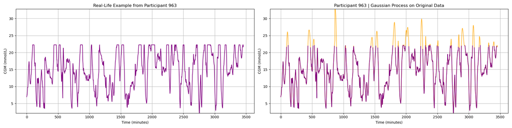
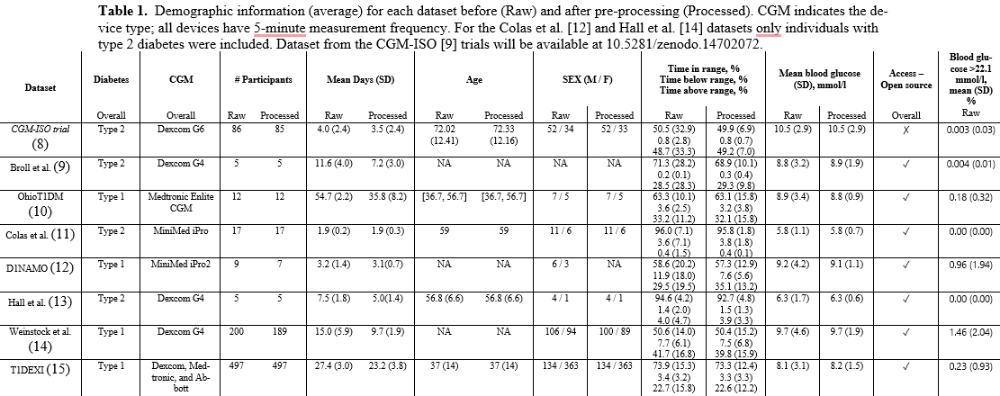

---

# Imputation Model for Glucose Values Out of Measuring Range for CGMs

This repository provides a Bayesian non-parametric latent Gaussian process regression model for imputation of right-censored CGM data, using the **GPy** library.



## Features
- **Gaussian Process Regression (GPR)** for imputation of right-censored CGM data.
- Calculate the bias and the mean squared error (MSE) of standard CGM metrics, i.e., mean glucose level, standard deviation (SD) and coefficient of variation (CV). 

## Installation
Clone the repository and install dependencies:
```bash
git clone https://github.com/AIHNlab/imputation_OOR.git
pip install -r requirements.txt
```

## Datasets


## Running the Model for specific dataset, kernel, and percentile
```bash
python main.py --dataset ohio --method gp --percentile 0.8 --kernel matern32
```

## Reproducing the results
```bash
./run.sh
```

## Dependencies
- **Python 3.8+**, **GPy**, **NumPy**, **Pandas**

## License
MIT License

---
